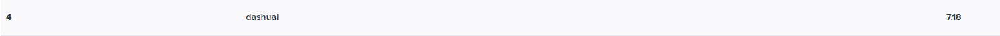
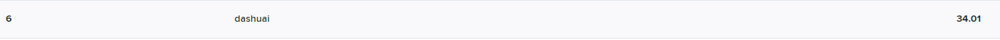

-----------------

[](https://github.com/qdslovelife/bustub/actions/workflows/codev.yml)
[](https://codecov.io/gh/qdslovelife/bustub)
[](https://www.codacy.com?utm_source=github.com&amp;utm_medium=referral&amp;utm_content=qdslovelife/bustub&amp;utm_campaign=Badge_Grade)

BusTub is a relational database management system built at [Carnegie Mellon University](https://db.cs.cmu.edu) for the [Introduction to Database Systems](https://15445.courses.cs.cmu.edu) (15-445/645) course. This system was developed for educational purposes and should not be used in production environments.

## Gradescope

**As for November 26, 2021.**

- [x] Buffer Pool Manager 
- [x] Hash Index 
- [x] Query Execution
- [x] Concurrency Control 

## Build

### Linux

To ensure that you have the proper packages on your machine, run the following script to automatically install them.

Note: This script will install GTest using [vcpkg](https://github.com/microsoft/vcpkg). If you don't like it, you can modify the script and  CMakeLists.txt and use it the way you prefer.

```
$ sudo build_support/packages.sh
```

Then run the following commands to build the system:

```
$ mkdir build
$ cd build
$ cmake -DCMAKE_BUILD_TYPE=Debug -GNinja ..
$ ninja
```

## Format

```
$ cd build
$ ninja format
```

## Static Analysis

```
$ cd build
$ ninja check-lint
$ ninja check-clang-tidy
```

## Testing

```
$ cd build
$ ninja check-tests
```
